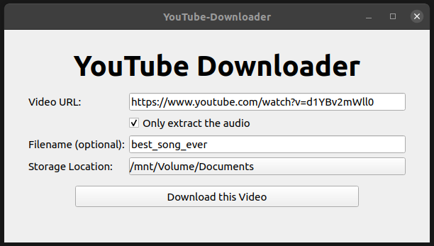

# YouTube Downloader
This is a graphical YouTube Downloader written in python which is able to download a YouTube video or only the audio of the video in in the highest quality.

Maybe it doesn't look really beautiful (I'm not the world's best designer 😉) but it works.



## Installation
### Clone Repository
```bash
git clone https://github.com/SH1RL0CK/youtube_downloader.git
```
### Python Packages
```bash
cd youtube_downloader
pip3 install -r requirements.txt
```
### ffmpeg
For downloading the YouTube Videos I use the tool yotube-dl which needs the tool ffmpeg to convert the videos.

#### Linux (Debain)
```bash
sudo apt-get install ffmpeg 
```
#### Windows
You can follow the instructions of this article: https://windowsloop.com/install-ffmpeg-windows-10

## Run
```bash
python3 youtube_downloader.py
```
Have Fun! 😊

## Credits
youtube-dl: https://github.com/ytdl-org/youtube-dl 

PySide2: https://github.com/pyside

